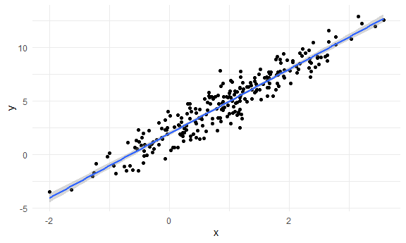
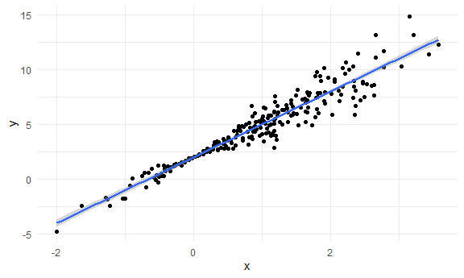
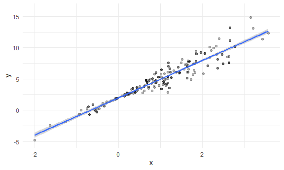
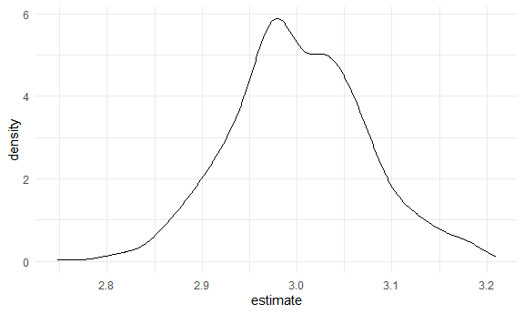
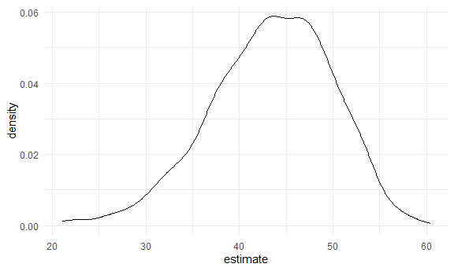

bootstrapping
================

## Simulate data

``` r
n_samp = 250

sim_df_const = 
  tibble(
    x = rnorm(n_samp, 1, 1),
    error = rnorm(n_samp, 0, 1),
    y = 2 + 3 * x + error
  )

sim_df_nonconst = sim_df_const %>% 
  mutate(
  error = error * .75 * x,
  y = 2 + 3 * x + error
)
```

Plot the datasets

``` r
sim_df_const %>%
  ggplot(aes(x = x, y = y)) +
  geom_point() +
  geom_smooth(method = "lm")
```

    ## `geom_smooth()` using formula 'y ~ x'



matches SLR assumptions: linear association; observations evenly
scattered around line; residuals constant variance

``` r
sim_df_nonconst %>%
  ggplot(aes(x = x, y = y)) +
  geom_point() +
  geom_smooth(method = "lm")
```

    ## `geom_smooth()` using formula 'y ~ x'



x closer to 0, residuals smaller -\> non-constant variance

``` r
lm(y ~ x, data = sim_df_const) %>% broom::tidy()
```

    ## # A tibble: 2 × 5
    ##   term        estimate std.error statistic   p.value
    ##   <chr>          <dbl>     <dbl>     <dbl>     <dbl>
    ## 1 (Intercept)     1.97    0.0899      21.9 6.23e- 60
    ## 2 x               3.00    0.0659      45.5 2.75e-122

``` r
lm(y ~ x, data = sim_df_nonconst) %>% broom::tidy()
```

    ## # A tibble: 2 × 5
    ##   term        estimate std.error statistic   p.value
    ##   <chr>          <dbl>     <dbl>     <dbl>     <dbl>
    ## 1 (Intercept)     1.98    0.0808      24.4 5.18e- 68
    ## 2 x               3.00    0.0593      50.6 1.03e-132

std error similar in both intercept and slope, surprising because
nonconst dataset has less var in residuals when x close to 0, so we
would expect less std error for intercept

## Draw one boostrap sample

``` r
boot_sample = function(df) {
  sample_frac(df, replace = TRUE) %>% #by default, sample_frac draw sample of the same size from the input, replace = TRUE so we don't get the exactly same sample
    arrange(x) #arrange rows by x
}
```

Check if this works

``` r
boot_sample(sim_df_nonconst) %>%
  ggplot(aes(x = x, y = y)) +
  geom_point(alpha = .3) +
  geom_smooth(method = "lm") +
  ylim(-5, 16)
```

    ## `geom_smooth()` using formula 'y ~ x'



Sample size stayed the same, got some observation multiple times,
function seems to be working.

``` r
boot_sample(sim_df_nonconst) %>%
  lm(y ~ x, data = .) %>%
  broom::tidy()
```

    ## # A tibble: 2 × 5
    ##   term        estimate std.error statistic   p.value
    ##   <chr>          <dbl>     <dbl>     <dbl>     <dbl>
    ## 1 (Intercept)     2.08    0.0845      24.7 1.18e- 68
    ## 2 x               2.90    0.0604      48.0 1.75e-127

## Many samples and analysis

``` r
boot_straps = 
  tibble(
    strap_number = 1:1000,
    strap_sample = rerun(1000, boot_sample(sim_df_nonconst)) #rerun this function 1000 times
  )
```

Can I run my analysis on these?

``` r
boot_results = 
  boot_straps %>%
  mutate(
    models = map(.x = strap_sample, ~lm(y ~ x, data = .x)),
    results = map(models, broom::tidy)
  ) %>%
  select(strap_number, results) %>%
  unnest(results)
```

What do I have now?

``` r
boot_results %>%
  group_by(term) %>%
  summarize(
    mean_est = mean(estimate),
    sd_est = sd(estimate)
  )
```

    ## # A tibble: 2 × 3
    ##   term        mean_est sd_est
    ##   <chr>          <dbl>  <dbl>
    ## 1 (Intercept)     1.97 0.0508
    ## 2 x               3.00 0.0717

Check the mean and sd of intercept and coefficient of our 1000
bootstrapping samples. This is the actual uncertainty in the intercept
and coefficient without assuming constant variance.

sd for intercept lower in bootstrap than in lm, sd for coefficient
higher in bootstrap than in lm. This makes sense considering our dataset
has less variance closer to x=0.

Look at the distributions

``` r
boot_results %>%
  filter(term == "x") %>%
  ggplot(aes(x = estimate)) +
  geom_density()
```



Under repeated sampling, this is the distribution of estimated
coefficient (without any assumption).

Construct boostrap CI

``` r
boot_results %>%
  group_by(term) %>%
  summarize(
    ci_lower = quantile(estimate, 0.025),
    ci_higher = quantile(estimate, 0.975)
  )
```

    ## # A tibble: 2 × 3
    ##   term        ci_lower ci_higher
    ##   <chr>          <dbl>     <dbl>
    ## 1 (Intercept)     1.88      2.08
    ## 2 x               2.86      3.15

## Boostrap using modelr

Can we simplify anything?

``` r
sim_df_nonconst %>%
  bootstrap(1000, id = "strap_number") %>%
  mutate(
    models = map(.x = strap, ~lm(y ~ x, data = .x)),
    results = map(models, broom::tidy)
  ) %>%
  select(strap_number, results) %>%
  unnest(results) %>%
  group_by(term) %>%
  summarize(
    mean_est = mean(estimate),
    sd_est = sd(estimate)
  )
```

    ## # A tibble: 2 × 3
    ##   term        mean_est sd_est
    ##   <chr>          <dbl>  <dbl>
    ## 1 (Intercept)     1.98 0.0483
    ## 2 x               3.00 0.0700

`modelr::bootstrap` create specified amount of bootstraps as resample
objects.

Estimate a little different but approximately the same.

## Reviist nyc airbnb

``` r
data("nyc_airbnb")

nyc_airbnb = 
  nyc_airbnb %>% 
  mutate(stars = review_scores_location / 2) %>% 
  rename(
    borough = neighbourhood_group,
    neighborhood = neighbourhood) %>% 
  filter(borough != "Staten Island") %>% 
  drop_na(price, stars) %>% 
  select(price, stars, borough, neighborhood, room_type)
```

``` r
nyc_airbnb %>%
  ggplot(aes(x = stars, y = price)) +
  geom_point()
```


nonconstant variance for higher stars. Non linear relationship between
price and stars.

``` r
airbnb_boot_results = 
  nyc_airbnb %>%
  filter(borough == "Manhattan") %>%
  drop_na(stars) %>%
  bootstrap(1000, id = "strap_number") %>%
  mutate(
    models = map(.x = strap, ~lm(price ~ stars, data = .x)),
    results = map(models, broom::tidy)
  ) %>%
  select(strap_number, results) %>%
  unnest(results)

airbnb_boot_results %>%
  group_by(term) %>%
  summarize(
    mean_est = mean(estimate),
    sd_est = sd(estimate)
  )
```

    ## # A tibble: 2 × 3
    ##   term        mean_est sd_est
    ##   <chr>          <dbl>  <dbl>
    ## 1 (Intercept)    -35.0  31.9 
    ## 2 stars           43.4   6.49

Compare this to `lm`

``` r
nyc_airbnb %>%
  filter(borough == "Manhattan") %>%
  drop_na(stars) %>%
  lm(price ~ stars, data = .) %>%
  broom::tidy()
```

    ## # A tibble: 2 × 5
    ##   term        estimate std.error statistic  p.value
    ##   <chr>          <dbl>     <dbl>     <dbl>    <dbl>
    ## 1 (Intercept)    -34.3     22.9      -1.50 1.35e- 1
    ## 2 stars           43.3      4.78      9.07 1.39e-19

Higher sd under boodstrap

``` r
airbnb_boot_results %>%
  filter(term == "stars") %>%
  ggplot(aes(x = estimate)) +
  geom_density()
```


