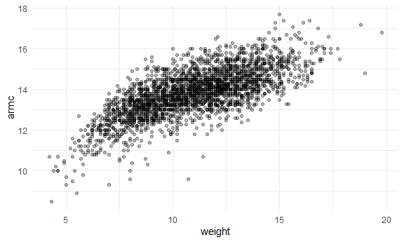
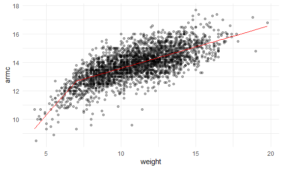

cross validation
================

## Step one

Cross validation “by hand” on simulated data

``` r
nonlin_df = 
  tibble(
    id = 1:100,
    x = runif(100, 0, 1),
    y = 1 - 10 * (x - .3) ^ 2 + rnorm(100, 0, .3)
  )

nonlin_df %>% 
  ggplot(aes(x = x, y = y)) + 
  geom_point()
```


Let’s get this by hand

``` r
train_df = sample_n(nonlin_df, 80)
test_df = anti_join(nonlin_df, train_df, by = "id")
```

``` r
train_df %>%
  ggplot(aes(x = x, y = y)) + 
  geom_point() +
  geom_point(data = test_df, color = "red")
```


Let’s try to fit three models.

``` r
linear_mod = lm(y ~ x, data = train_df)
smooth_mod = mgcv::gam(y ~ s(x), data = train_df)
wiggly_mod = mgcv::gam(y ~ s(x, k = 30), sp = 10e-6, data = train_df) #put too much non-linearity 
```

Let’s see the results.

``` r
train_df %>%
  add_predictions(linear_mod) %>%
  ggplot(aes(x = x, y = y)) +
  geom_point() +
  geom_line(aes(y = pred), color = "red")
```


``` r
train_df %>%
  add_predictions(smooth_mod) %>%
  ggplot(aes(x = x, y = y)) +
  geom_point() +
  geom_line(aes(y = pred), color = "red")
```


``` r
train_df %>%
  add_predictions(wiggly_mod) %>%
  ggplot(aes(x = x, y = y)) +
  geom_point() +
  geom_line(aes(y = pred), color = "red")
```


Let’s make predictions and compute RMSEs.

``` r
test_df %>% add_predictions(linear_mod)
```

    ## # A tibble: 20 × 4
    ##       id      x      y    pred
    ##    <int>  <dbl>  <dbl>   <dbl>
    ##  1     3 0.835  -1.43  -1.35  
    ##  2     8 0.206   1.05   0.931 
    ##  3    11 0.669  -0.420 -0.748 
    ##  4    15 0.230   0.841  0.845 
    ##  5    21 0.149   0.239  1.14  
    ##  6    24 0.0730  0.218  1.42  
    ##  7    28 0.917  -3.16  -1.65  
    ##  8    31 0.298   0.641  0.601 
    ##  9    34 0.297   0.769  0.602 
    ## 10    50 0.866  -2.03  -1.47  
    ## 11    59 0.627  -0.345 -0.595 
    ## 12    65 0.475   0.615 -0.0431
    ## 13    69 0.258   1.35   0.745 
    ## 14    79 0.293   1.90   0.616 
    ## 15    81 0.260   0.917  0.737 
    ## 16    87 0.789  -1.90  -1.19  
    ## 17    93 0.722  -1.11  -0.943 
    ## 18    94 0.0178 -0.439  1.62  
    ## 19    98 0.538   0.757 -0.274 
    ## 20   100 0.363   0.871  0.363

``` r
rmse(linear_mod, test_df)
```

    ## [1] 0.8264008

``` r
rmse(smooth_mod, test_df)
```

    ## [1] 0.3776688

``` r
rmse(wiggly_mod, test_df)
```

    ## [1] 0.4203024

## Can we iterate?

``` r
cv_df = 
  crossv_mc(nonlin_df, 100) %>% #splits into training and testing by 80/20 100 times
  mutate(
    train = map(train, as_tibble), #resample to tibbles
    test = map(test, as_tibble)
  ) %>%
  mutate(
    linear_fits = map(.x = train, ~lm(y ~ x, data = .x)),
    smooth_fits = map(.x = train, ~mgcv::gam(y ~ s(x), data = .x)),
    wiggly_fits = map(.x = train, ~mgcv::gam(y ~ s(x, k =30), sp = 10e-6, data = .x))
  ) %>%
  mutate(
    rmse_linear = map2_dbl(.x = linear_fits, .y = test, ~rmse(model = .x, data = .y)),
    rmse_smooth = map2_dbl(.x = smooth_fits, .y = test, ~rmse(model = .x, data = .y)),
    rmse_wiggly = map2_dbl(.x = wiggly_fits, .y = test, ~rmse(model = .x, data = .y))
  )
```

``` r
cv_df %>% pull(train) %>% .[[1]] %>% as_tibble #get the first training dataset
```

    ## # A tibble: 79 × 3
    ##       id     x      y
    ##    <int> <dbl>  <dbl>
    ##  1     3 0.835 -1.43 
    ##  2     4 0.109  0.122
    ##  3     5 0.964 -3.33 
    ##  4     6 0.912 -2.49 
    ##  5     7 0.219  0.674
    ##  6     8 0.206  1.05 
    ##  7     9 0.534  0.869
    ##  8    10 0.284  1.03 
    ##  9    11 0.669 -0.420
    ## 10    12 0.719 -0.925
    ## # … with 69 more rows

Make a box plot

``` r
cv_df %>%
  select(starts_with("rmse")) %>%
  pivot_longer(
    everything(),
    names_to = "model",
    values_to = "rmse",
    names_prefix = "rmse_"
  ) %>%
  ggplot(aes(x = model, y = rmse)) +
  geom_boxplot()
```


## Try it on a real dataset

``` r
growth_df = read_csv("./data/nepalese_children.csv")
```

    ## Rows: 2705 Columns: 5
    ## ── Column specification ────────────────────────────────────────────────────────
    ## Delimiter: ","
    ## dbl (5): age, sex, weight, height, armc
    ## 
    ## ℹ Use `spec()` to retrieve the full column specification for this data.
    ## ℹ Specify the column types or set `show_col_types = FALSE` to quiet this message.

``` r
growth_df %>%
  ggplot(aes(x = weight, y = armc)) +
  geom_point(alpha = .3)
```



Brief aside on piecewide linear models.

``` r
growth_df = 
  growth_df %>%
  mutate(
    weight_pwl = (weight > 7) * (weight - 7)
  )
```

``` r
pwl_model = lm(armc ~ weight + weight_pwl, data = growth_df) #linear model in two pieces using 7 as a cutoff point
linear_model = lm(armc  ~ weight, data = growth_df)
smooth_model = mgcv::gam(armc ~ s(weight), data = growth_df)
```

``` r
growth_df %>%
  add_predictions(pwl_model) %>%
  ggplot(aes(x = weight, y = armc)) +
  geom_point(alpha = .3) +
  geom_line(aes(y = pred), color = "red")
```



``` r
cv_df = 
  crossv_mc(growth_df, 100) %>% 
  mutate(
    train = map(train, as_tibble),
    test = map(test, as_tibble)
  )
```

``` r
cv_df = 
  cv_df %>% 
  mutate(
    linear_fits = map(train, ~lm(armc ~ weight, data = .x)),
    pwl_fits = map(train, ~lm(armc ~ weight + weight_pwl, data = .x)),
    smooth_fits = map(train, ~gam(armc ~ s(weight), data = as_tibble(.x)))) %>% 
  mutate(
    rmse_linear = map2_dbl(linear_fits, test, ~rmse(model = .x, data = .y)),
    rmse_pwl = map2_dbl(pwl_fits, test, ~rmse(model = .x, data = .y)),
    rmse_smooth = map2_dbl(smooth_fits, test, ~rmse(model = .x, data = .y)))
```

``` r
cv_df %>%
  select(starts_with("rmse")) %>%
  pivot_longer(
    everything(),
    names_to = "model",
    values_to = "rmse",
    names_prefix = "rmse_"
  ) %>%
  ggplot(aes(x = model, y = rmse)) +
  geom_boxplot()
```


